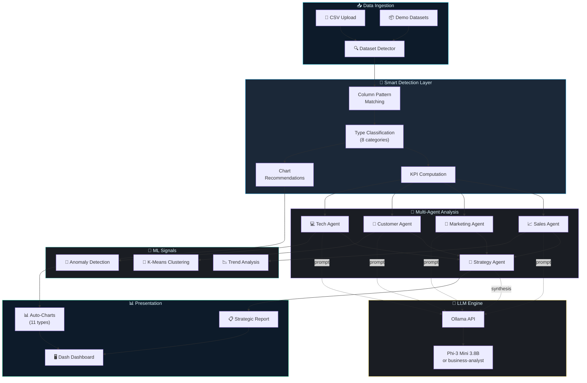
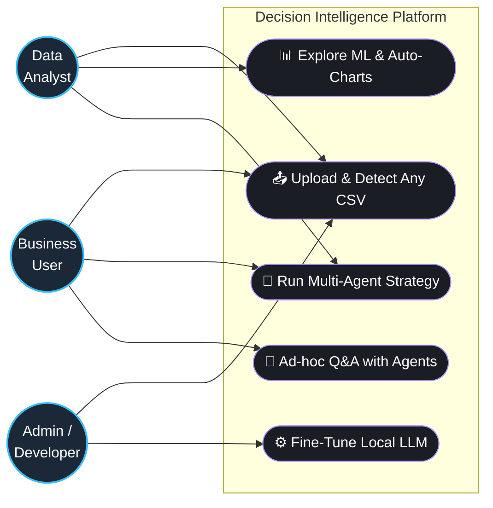
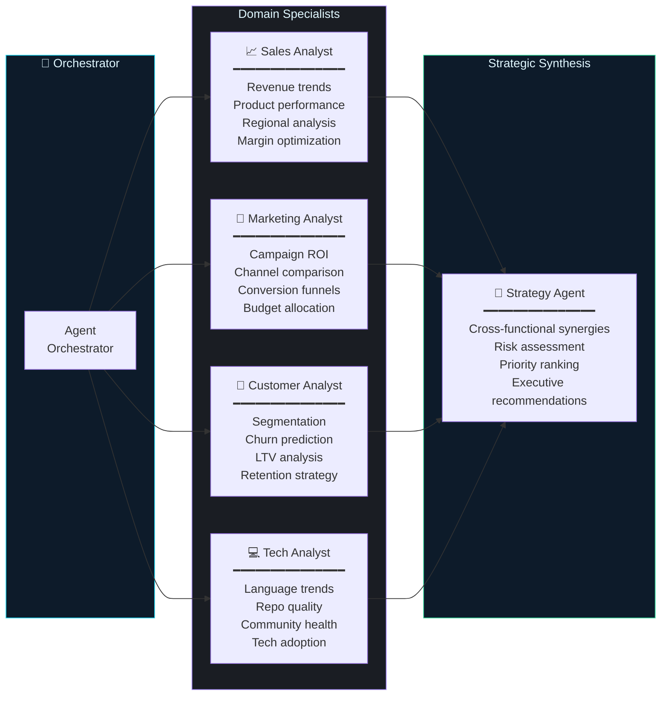
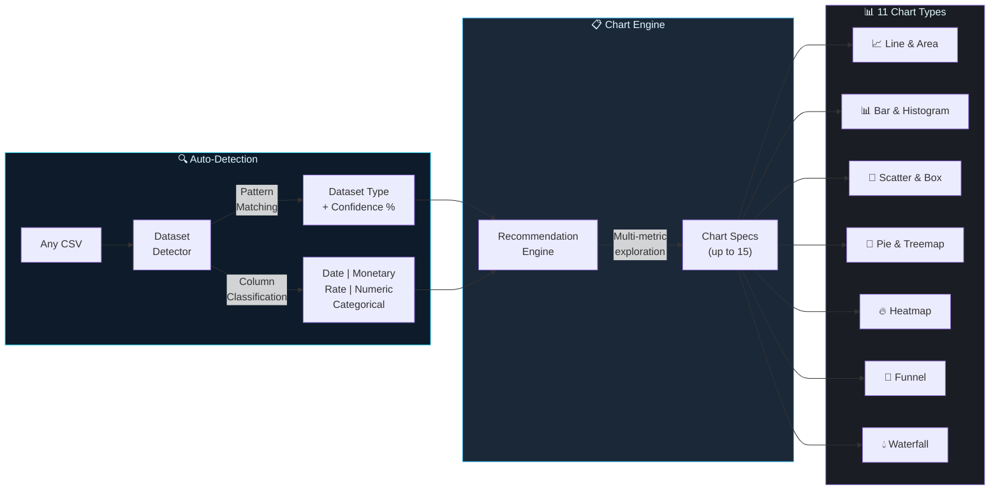
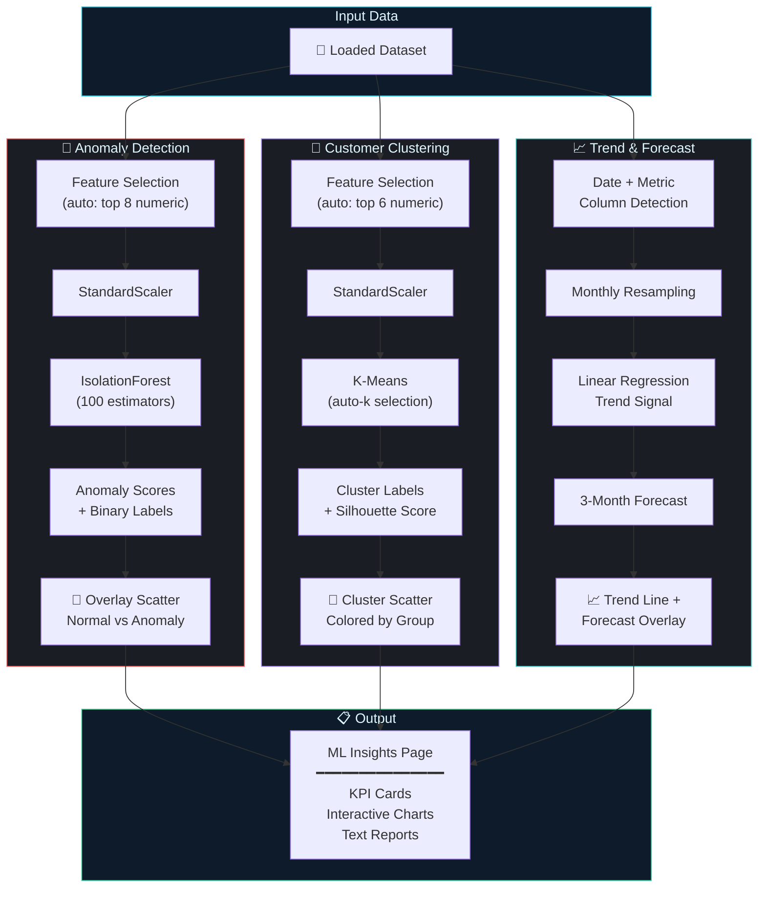
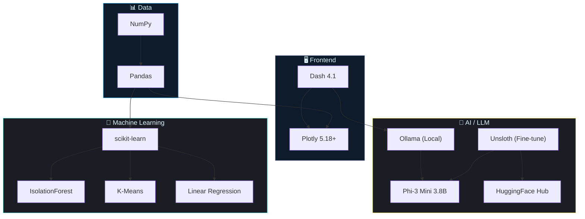

<div align="center">

# 🧠 Autonomous Multi-Agent Decision Intelligence Platform

### _Where AI Agents Collaborate to Turn Raw Data into Strategic Decisions_

[](https://python.org)
[](https://dash.plotly.com)
[](https://ollama.com)
[](https://huggingface.co/microsoft/Phi-3-mini-4k-instruct)
[](https://plotly.com)
[](https://scikit-learn.org)
[](https://huggingface.co/HeshamXOR)

---

**An end-to-end, local-first business intelligence system** that deploys a team of specialized AI agents — each an expert in Sales, Marketing, Customer Analytics, or Technology — orchestrated by a Strategy Agent that synthesizes cross-domain insights into executive-ready recommendations.

**No cloud APIs. No data leaves your machine. Fully open-source.**

[🚀 Quick Start](#-quick-start) · [📊 Features](#-features) · [🏗️ Architecture](#%EF%B8%8F-system-architecture) · [🤖 Agents](#-the-agent-team) · [📈 Visualizations](#-smart-visualizations) · [🔬 ML Insights](#-ml-insights-engine) · [🎓 Fine-Tuning](#-fine-tuning)

</div>

---

## ✨ Features

<table>
<tr>
<td width="50%">

### 🤖 Multi-Agent AI System
Five specialized LLM-powered agents collaborate: **Sales**, **Marketing**, **Customer**, **Tech**, and a **Strategy** synthesizer — each producing grounded, data-backed analysis reports.

### 📊 11 Smart Chart Types
Auto-detection generates the right visuals: line, bar, scatter, histogram, pie, box, **heatmap**, **stacked area**, **treemap**, **funnel**, and **waterfall** charts.

### 🧠 ML-Powered Insights
Automated **anomaly detection** (IsolationForest), **customer clustering** (K-Means), and **trend forecasting** (linear regression) with rich visualizations.

</td>
<td width="50%">

### 🔍 Universal Dataset Detection
Upload _any_ CSV — the platform auto-detects its type (sales, marketing, customers, financial, HR, inventory, survey, tech, or generic) with confidence scoring and fuzzy column matching.

### 🏠 100% Local & Private
Runs entirely on your machine via **Ollama** — no cloud APIs, no data exfiltration. Works offline after initial model download.

### 🎓 Custom Fine-Tuning
Optional QLoRA fine-tuning pipeline on **Phi-3 Mini** with Unsloth. Pre-trained weights published on HuggingFace for instant use.

</td>
</tr>
</table>

---

## 🏗️ System Architecture

> _How data flows from upload to actionable recommendations_



---

## 🧑‍💼 System Use Cases

> _How different roles interact with the platform to extract value_



---

## 🤖 The Agent Team

> _Each agent is a specialized AI analyst with domain expertise_



| Agent | Specialization | ML Signals | Key Outputs |
|:------|:---------------|:-----------|:------------|
| 📈 **Sales Analyst** | Revenue, products, regions, margins | Trend analysis, forecasting | Revenue health, growth opportunities |
| 📣 **Marketing Analyst** | Campaigns, channels, ROI, conversions | Trend analysis | Channel optimization, budget reallocation |
| 👥 **Customer Analyst** | Segments, churn, LTV, satisfaction | K-Means clustering | Retention strategies, segment profiles |
| 💻 **Tech Analyst** | Repos, languages, quality, community | Anomaly detection | Tech investment priorities |
| 🎯 **Strategy Agent** | Cross-domain synthesis | _All signals_ | Executive action plan (0-365 days) |

---

## 📊 Smart Visualizations

> _The platform auto-detects your data and generates the most appropriate charts_



<details>
<summary><b>📋 All 11 Chart Types</b></summary>

| # | Chart Type | Auto-Triggered When | Example Use Case |
|:-:|:-----------|:--------------------|:-----------------|
| 1 | 📈 **Line** | Date + numeric column detected | Revenue over time |
| 2 | 📊 **Bar** | Category + metric column detected | Revenue by region |
| 3 | 🔵 **Scatter** | 2+ numeric columns with variation | Stars vs Forks |
| 4 | 📉 **Histogram** | Numeric column with distribution | Score distribution |
| 5 | 🍩 **Pie/Donut** | Categorical column with 2-50 values | Segment breakdown |
| 6 | 📦 **Box Plot** | Category + continuous numeric | LTV by segment |
| 7 | 🔥 **Heatmap** | 3+ numeric columns | Correlation matrix |
| 8 | 📊 **Stacked Area** | Date + metric + category | Revenue composition over time |
| 9 | 🌳 **Treemap** | 2+ categorical + metric | Category → Product → Revenue |
| 10 | 🔻 **Funnel** | Impression/click/conversion columns | Marketing conversion funnel |
| 11 | 💧 **Waterfall** | Financial dataset + categories | Revenue contribution waterfall |

</details>

---

## 🔬 ML Insights Engine

> _Three automated ML pipelines that run without configuration_



| ML Feature | Algorithm | Input | Output | Visual |
|:-----------|:----------|:------|:-------|:-------|
| 🚨 **Anomaly Detection** | IsolationForest | Any numeric columns | Anomaly scores + flags | Overlay scatter (red = anomaly) |
| 🎯 **Clustering** | K-Means + Silhouette | Auto-selected features | Cluster assignments | Colored scatter by cluster |
| 📈 **Trend Analysis** | Linear Regression | Date + metric pairs | Direction, R², growth % | Trend line + 3-month forecast |

---

## 🗂️ Repository Layout

```text
📁 BuisnessBI/
│
├── 🖥️  app/                          # Dash application
│   ├── main.py                       #   ↳ Dash entry point wrapper
│   ├── run.py                        #   ↳ Dash dev server launcher
│   ├── callbacks.py                  #   ↳ Page routing + shared callbacks
│   ├── layout.py                     #   ↳ App shell and navigation layout
│   ├── state.py                      #   ↳ Shared in-memory app state
│   ├── assets/style.css              #   ↳ Global Dash styling
│   └── pages/
│       ├── data_upload.py            #   ↳ CSV upload with delimiter/encoding
│       ├── data_overview.py          #   ↳ Schema, dtypes, correlations, quality
│       ├── visualizations.py         #   ↳ Domain + auto-generated charts (11 types)
│       ├── ml_insights.py            #   ↳ Anomaly / Clustering / Forecast visuals
│       ├── ai_insights.py            #   ↳ Single-dataset LLM analysis
│       ├── multi_agent.py            #   ↳ Full orchestrated agent pipeline
│       └── recommendations.py        #   ↳ Prioritized strategic actions
│
├── 🤖  agents/                       # Multi-agent system
│   ├── base_agent.py                 #   ↳ Abstract base class
│   ├── sales_agent.py                #   ↳ Revenue & product analysis
│   ├── marketing_agent.py            #   ↳ Campaign & channel analysis
│   ├── customer_agent.py             #   ↳ Segmentation & churn analysis
│   ├── tech_agent.py                 #   ↳ GitHub/tech landscape analysis
│   ├── strategy_agent.py             #   ↳ Cross-domain synthesis
│   └── orchestrator.py               #   ↳ Pipeline orchestration
│
├── 🧠  llm/                          # LLM inference layer
│   ├── llm_client.py                 #   ↳ Ollama client with timeout + fallback
│   ├── prompts.py                    #   ↳ Engineered prompt templates
│   └── response_parser.py            #   ↳ Structured output parser
│
├── 🔬  ml/                           # Machine learning modules
│   ├── trend_analysis.py             #   ↳ Linear regression trend + forecast
│   ├── clustering.py                 #   ↳ K-Means customer segmentation
│   └── anomaly_detection.py          #   ↳ IsolationForest outlier detection
│
├── 🛠️  utils/                        # Core utilities
│   ├── dataset_detector.py           #   ↳ Auto-classification (8 types + generic)
│   ├── data_loader.py                #   ↳ CSV loading + validation
│   ├── analysis.py                   #   ↳ KPI computation + statistics
│   └── helpers.py                    #   ↳ Formatting utilities
│
├── 🎨  components/                   # UI components
│   ├── charts.py                     #   ↳ 11 auto-chart types + ML charts
│   ├── theme.py                      #   ↳ Dark theme configuration
│   └── ui_elements.py                #   ↳ Optional legacy Streamlit widgets
│
├── 📦  data/                         # Dataset generation
│   └── generate_datasets.py          #   ↳ 4 realistic synthetic datasets
│
├── 🎓  finetune/                     # Fine-tuning pipeline
│   ├── train.py                      #   ↳ QLoRA training with Unsloth
│   ├── prepare_dataset.py            #   ↳ HF dataset aggregation
│   ├── create_modelfile.py           #   ↳ Ollama Modelfile generator
│   ├── hf_hub.py                     #   ↳ HuggingFace upload/download
│   └── README.md                     #   ↳ Detailed fine-tuning guide
│
├── 📓  main.ipynb                    # End-to-end notebook pipeline
├── 📄  requirements.txt              # Python dependencies
├── ⚙️  .env.example                  # Environment configuration template
└── 📝  README.md                     # ← You are here
```

---

## 🚀 Quick Start

### Prerequisites

| Requirement | Version | Purpose |
|:------------|:--------|:--------|
| Python | 3.10+ | Runtime |
| Ollama | Latest | Local LLM inference |
| pip | Latest | Package management |

### 1️⃣ Install Dependencies

```bash
pip install -r requirements.txt
```

### 2️⃣ Start Ollama & Pull Model

```bash
# Terminal 1: Start the Ollama daemon
ollama serve

# Terminal 2: Pull the default model
ollama pull phi3:mini
```

### 3️⃣ Configure Environment

```bash
cp .env.example .env
```

Edit `.env` to customize (defaults work out of the box):

```env
OLLAMA_MODEL=phi3:mini           # Or: business-analyst, llama3.1:8b
OLLAMA_BASE_URL=http://localhost:11434
LLM_TEMPERATURE=0.3
DATA_DIR=data
```

### 4️⃣ Generate Demo Datasets

```bash
python data/generate_datasets.py
```

> Generates 4 realistic CSV datasets: **Sales** (1K rows), **Marketing** (500), **Customers** (800), **GitHub Repos** (600)

### 5️⃣ Launch the Dashboard

```bash
/usr/bin/python -m app.main
```

> Open **http://localhost:8050** — you're ready to go! 🎉

---

## 📑 Dashboard Pages

| Page | Purpose | Key Features |
|:-----|:--------|:-------------|
| 📤 **Data Upload** | Load your data | CSV upload, delimiter/encoding controls, demo data loading |
| 📋 **Data Overview** | Understand your data | Schema, dtypes, statistics, correlation heatmap, data quality |
| 📊 **Visualizations** | See your data | Auto-generated charts (11 types), domain-specific views, secondary type detection |
| 🧠 **ML Insights** | Automated ML analysis | Anomaly detection, clustering, trend forecasting — fully automatic |
| 🤖 **AI Insights** | LLM-powered analysis | Single-dataset grounded analysis with hallucination guardrails |
| 🔗 **Multi-Agent** | Full AI pipeline | All 5 agents run with live progress tracking |
| 🎯 **Recommendations** | Take action | Prioritized strategic actions from combined AI + ML insights |

---

## ⚡ Optional: Register Custom Fine-Tuned Model

> _Upgrade from base Phi-3 to our business-focused fine-tune in 30 seconds_

**Option A — Prompt-engineered Modelfile (no GPU needed):**

```bash
python finetune/create_modelfile.py --approach prompt --base-model phi3:mini
ollama create business-analyst -f finetune/Modelfile
```

**Option B — Download pre-trained weights from HuggingFace:**

```bash
export HF_TOKEN=your_token
python finetune/hf_hub.py quick-download --which merged
```

**Option C — Full fine-tuning (requires GPU):**

```bash
python finetune/prepare_dataset.py
python -u finetune/train.py --model unsloth/Phi-3-mini-4k-instruct \
    --epochs 3 --batch-size 8 --lora-rank 64 --max-samples 20000
```

Then update `.env`:

```env
OLLAMA_MODEL=business-analyst
```

> **Published HuggingFace repos:**
> [`HeshamXOR/business-analyst-phi3-mini-lora`](https://huggingface.co/HeshamXOR/business-analyst-phi3-mini-lora) ·
> [`HeshamXOR/business-analyst-phi3-mini-merged`](https://huggingface.co/HeshamXOR/business-analyst-phi3-mini-merged)

---

## 📓 Notebook Workflow

The full pipeline can also run in `main.ipynb`:

```
1. Install dependencies + start Ollama
2. Download fine-tuned model from HuggingFace
3. Register business-analyst in Ollama
4. Load/generate datasets
5. Run individual agents + orchestration
6. Launch Dash dashboard
```

---

## 🛡️ Technology Stack



---

## 🔧 Configuration Reference

| Variable | Default | Description |
|:---------|:--------|:------------|
| `OLLAMA_MODEL` | `phi3:mini` | LLM model to use |
| `OLLAMA_BASE_URL` | `http://localhost:11434` | Ollama API endpoint |
| `LLM_TEMPERATURE` | `0.3` | Generation temperature (0 = deterministic) |
| `DATA_DIR` | `data` | Default data directory |

**Available models** (fastest → most capable):

| Model | Size | Speed | Quality | Best For |
|:------|:-----|:------|:--------|:---------|
| `gemma2:2b` | 2B | ⚡⚡⚡⚡⚡ | ★★★☆☆ | Quick iterations |
| `phi3:mini` | 3.8B | ⚡⚡⚡⚡ | ★★★★☆ | **Default** — best speed/quality |
| `business-analyst` | 3.8B | ⚡⚡⚡⚡ | ★★★★★ | Fine-tuned for business data |
| `llama3.1:8b` | 8B | ⚡⚡⚡ | ★★★★☆ | Balanced general purpose |
| `phi3:medium` | 14B | ⚡⚡ | ★★★★★ | Highest quality |

---

## 🔥 Troubleshooting

<details>
<summary><b>🔴 Ollama not connected</b></summary>

```bash
# 1. Start the daemon
ollama serve

# 2. Verify models
ollama list

# 3. Pull if needed
ollama pull phi3:mini
```

</details>

<details>
<summary><b>🟡 Model unavailable message</b></summary>

Ensure `.env` model name matches an installed model:
```bash
ollama list                    # See available models
# Update .env if needed:
# OLLAMA_MODEL=phi3:mini

# Or register custom model:
python finetune/create_modelfile.py --approach prompt --base-model phi3:mini
ollama create business-analyst -f finetune/Modelfile
```

</details>

<details>
<summary><b>🟡 Slow responses or timeout</b></summary>

- Use a smaller model (`phi3:mini` or `gemma2:2b`)
- Check GPU utilization: `nvidia-smi -l 1`
- Reduce `LLM_TEMPERATURE` to `0.1` for faster generation
- Ensure Ollama is healthy before launching long workflows

</details>

<details>
<summary><b>🟡 No datasets loaded</b></summary>

```bash
python data/generate_datasets.py    # Generate demo data
# Or upload CSVs from the Data Upload page
```

</details>

---

## 🧑‍💻 Development

```bash
# Clone the repo
git clone https://github.com/HeshamXOR/BuisnessBI.git
cd BuisnessBI

# Set up environment
pip install -r requirements.txt
cp .env.example .env

# Generate data + launch
python data/generate_datasets.py
/usr/bin/python -m app.main
```

### Design Principles

- **🏗️ Modular** — Each concern isolated: `agents/`, `llm/`, `ml/`, `utils/`, `app/`
- **🔌 Pluggable** — Swap models, add agents, or extend chart types without refactoring
- **🛡️ Resilient** — LLM fallback responses when Ollama is unavailable
- **📊 Data-First** — Zero hardcoded assumptions; everything auto-detected from your data

---

<div align="center">

**Local AI · Multi-Agent Systems · Business Intelligence · Machine Learning**

_Upload any CSV. Let the agents handle the rest._

</div>
