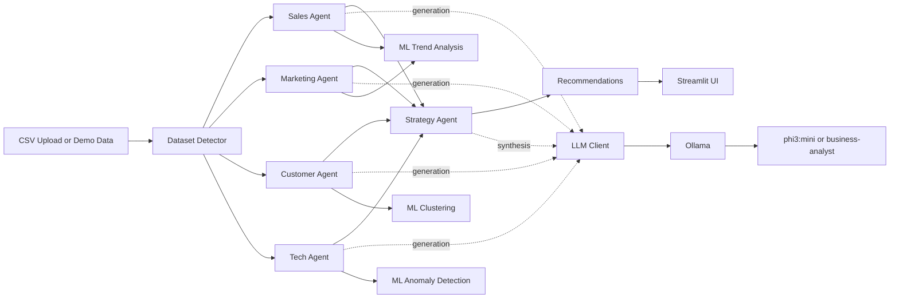

# Autonomous Multi-Agent Decision Intelligence Platform

A local-first business intelligence system that combines data analytics, machine learning signals, and a multi-agent LLM workflow to produce actionable recommendations.

This repository is intentionally code-only.
Datasets and fine-tuned model artifacts are downloaded or generated at runtime.

## Key Capabilities

- Multi-agent analysis pipeline across Sales, Marketing, Customer, Tech, and Strategy domains.
- Local LLM inference through Ollama, with optional custom model registration (`business-analyst`).
- Dynamic dataset type detection for arbitrary CSV inputs.
- Streamlit dashboard for upload, overview, visualizations, AI insights, and recommendations.
- Optional ML signals: trend analysis, clustering, and anomaly detection.
- Notebook workflow for full end-to-end orchestration.

## Architecture



## Repository Layout

```text
.
├── app/                     # Streamlit app and pages
├── agents/                  # Specialist agents + orchestrator
├── components/              # Charts, theme, reusable UI elements
├── data/                    # Data generator script (CSVs generated at runtime)
├── finetune/                # Fine-tune utilities and HF hub helpers
├── llm/                     # Ollama client, prompts, response parser
├── ml/                      # Trend, clustering, anomaly modules
├── utils/                   # Data loading, analysis, dataset detection
├── main.ipynb               # End-to-end notebook pipeline
└── requirements.txt
```

## Runtime Flow

1. Load demo datasets or upload custom CSV files.
2. Detect dataset schema using pattern-based classification.
3. Compute KPIs and optional ML signals.
4. Run domain agents for independent reports.
5. Synthesize cross-agent findings with the strategy agent.
6. Present final recommendations and downloadable reports.

## Quick Start (Streamlit)

### 1) Install dependencies

```bash
pip install -r requirements.txt
```

### 2) Start Ollama

```bash
ollama serve
```

In another terminal:

```bash
ollama pull phi3:mini
```

### 3) (Optional) Register custom model in Ollama

```bash
python finetune/create_modelfile.py --approach prompt --base-model phi3:mini
ollama create business-analyst -f finetune/Modelfile
```

### 4) Configure environment

```bash
cp .env.example .env
```

Set the model in `.env`:

```env
OLLAMA_MODEL=phi3:mini
# or
# OLLAMA_MODEL=business-analyst
```

### 5) Generate demo datasets

```bash
python data/generate_datasets.py
```

### 6) Launch dashboard

```bash
streamlit run app/main.py
```

Open: http://localhost:8501

## Notebook Workflow

You can run the full pipeline in `main.ipynb`:

1. Install dependencies and start Ollama.
2. Download model artifacts from Hugging Face (no retraining path).
3. Register `business-analyst` in Ollama.
4. Load/generate datasets.
5. Run individual agents and orchestration.
6. Launch Streamlit.

## Hugging Face Artifacts

Published model repos:

- HeshamXOR/business-analyst-phi3-mini-lora
- HeshamXOR/business-analyst-phi3-mini-merged

Download helper:

```bash
export HF_TOKEN=your_token
python finetune/hf_hub.py quick-download --which merged
# or
python finetune/hf_hub.py quick-download --which lora
```

Note: the CLI helper currently requires `HF_TOKEN`.

## Main Pages

- Data Upload / Load: upload arbitrary CSV files with delimiter/encoding controls.
- Data Overview: schema, quality, and KPI summaries.
- Visualizations: domain-specific and auto-generated charts.
- AI Insights: strict, grounded single-dataset LLM analysis.
- Multi-Agent Analysis: full orchestrated pipeline with progress tracking.
- Recommendations: prioritized actions from combined insights.

## Configuration

Environment variables are defined in `.env.example`.

Common settings:

- `OLLAMA_MODEL` (default: `phi3:mini`)
- `OLLAMA_BASE_URL` (default: `http://localhost:11434`)
- `LLM_TEMPERATURE` (default: `0.3`)
- `DATA_DIR` (default: `data`)

## Troubleshooting

### Ollama not connected

- Start daemon: `ollama serve`
- Verify model exists: `ollama list`
- Pull base model: `ollama pull phi3:mini`

### Model unavailable message

- Ensure `.env` model name matches an installed Ollama model.
- If using custom model, run:
  - `python finetune/create_modelfile.py --approach prompt --base-model phi3:mini`
  - `ollama create business-analyst -f finetune/Modelfile`

### Slow responses or timeout fallback

- Use a smaller model (`phi3:mini`) for faster inference.
- Reduce output length where possible in analysis prompts.
- Ensure Ollama is healthy before launching long workflows.

### No datasets loaded

- Generate data: `python data/generate_datasets.py`
- Or upload CSVs from the Data Upload page.

## Development Notes

- The repository excludes runtime data and model outputs via `.gitignore`.
- Core logic is modularized by concern (agents, llm, ml, utils, app).
- The LLM client includes fallback behavior when Ollama is unavailable.

## License

No license file is currently provided in this repository.
If you plan public reuse, add a LICENSE file (for example, MIT or Apache-2.0).
